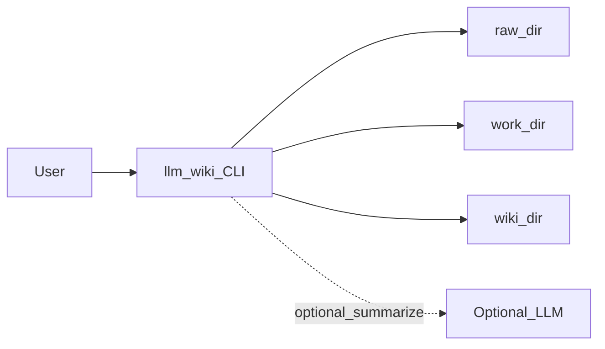

# Architecture (Phase 1)

## Design Goals

- Keep the system inspectable and maintainable for a solo builder.
- Center all workflows on local files and markdown notes.
- Keep modules small and composable.
- Preserve extension points for Phase 2 without complicating Phase 1.

## High-Level Flow

## Storage and Source of Truth

- `wiki/` markdown files are the canonical knowledge base.
- `raw/` stores original source materials and is not rewritten by processing commands.
- `work/` stores temporary processing state and ingest manifests.
- No database is required for Phase 1 operation.

## Suggested Module Boundaries

- `cli/`
  - command definitions and argument parsing
  - output formatting and exit code handling
- `library/`
  - library root discovery
  - folder bootstrap and path utilities
- `notes/`
  - frontmatter parsing/serialization
  - schema validation and note id resolution
- `ingest/`
  - source intake, manifest generation, note creation/update
- `search/`
  - keyword indexing/query across markdown corpus
- `linking/`
  - bidirectional relation updates for note metadata/links
- `check/`
  - consistency checks (schema, duplicate ids, broken links)
- `summarize/`
  - local summarization default
  - optional LLM adapter

## Command-to-Module Mapping

- `init` -> `library`
- `ingest` -> `ingest`, `notes`, `work` helpers
- `list` -> `notes`
- `search` -> `search`
- `open` -> `notes`, platform opener utility
- `summarize` -> `summarize`, `notes`
- `link` -> `linking`, `notes`
- `check` -> `check`, `notes`

## Operational Characteristics

- **Idempotence**: `init` and parts of `ingest` should be safe to re-run.
- **Determinism**: same inputs produce same note structure where possible.
- **Transparency**: all artifacts remain user-readable files.

## Phase 2 Compatibility

Phase 2 can introduce an optional intelligence layer that reads from `wiki/` and writes back through explicit commands. This allows future indexing, advanced retrieval, or reasoning services without replacing the Phase 1 filesystem model.
