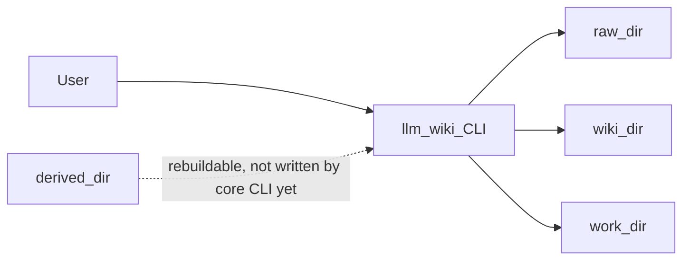

# Architecture (Phase 1)

## Design Goals

- Keep the system inspectable and maintainable for a solo builder.
- Center all workflows on local files and markdown notes.
- Keep modules small and composable.
- Preserve extension points for Phase 2 without complicating Phase 1.

## High-Level Flow

```mermaid
flowchart LR
  user[User]
  cli[llm_wiki_CLI]
  raw[raw_dir]
  wiki[wiki_dir]
  work[work_dir]
  derived[derived_dir]
  user --> cli
  cli --> raw
  cli --> wiki
  cli --> work
  derived -.->|"rebuildable, not written by core CLI yet"| cli
```

## Storage and Source of Truth

- `wiki/` markdown files are the canonical knowledge base.
- `raw/` stores copies of source material. It may be private. Ingest does not modify the original file outside the library.
- `work/` stores transient state. Ingest manifests include absolute local paths.
- `derived/` is the place for rebuildable graph, vector, semantic, and extraction outputs. Core commands do not write it yet. Nothing under `derived/` is canonical.
- `schema/` stores workflow conventions for maintainers. A user library also gets starter schema files from `init` when they are missing.
- No database is required for Phase 1 operation.
- The installed package is three modules: `cli.py`, `commands.py`, and `core.py`.

## Suggested Module Boundaries

The names below describe responsibilities inside those modules. They are not separate packages.

- `cli/`
  - command definitions and argument parsing
  - output formatting and exit code handling
- `library/`
  - library root discovery
  - folder bootstrap and path utilities
- `notes/`
  - frontmatter parsing/serialization
  - schema validation and note id resolution
- `ingest/`
  - source intake, manifest generation, note creation/update
- `search/`
  - keyword indexing/query across markdown corpus
- `linking/`
  - bidirectional relation updates for note metadata/links
- `check/`
  - consistency checks (schema, duplicate ids, broken links)
- `summarize/`
  - local summarization only
  - any non-local `--mode` exits 2

## Command-to-Module Mapping

- `init` -> `library`
- `ingest` -> `ingest`, `notes`, `work` helpers
- `list` -> `notes`
- `search` -> `search`
- `open` -> `notes`, platform opener utility
- `summarize` -> `summarize`, `notes`
- `link` -> `linking`, `notes`
- `check` -> `check`, `notes`
- `query` -> `search`, `notes`, `summarize`
- `lint` -> `check`, `notes`

## Operational Characteristics

- **Idempotence**: `init` is safe to re-run and does not overwrite starter files. Re-running `ingest` on the same filename creates a suffixed raw copy and a new note id. It does not rewrite the existing note.
- **Determinism**: same inputs produce same note structure where possible.
- **Transparency**: all artifacts remain user-readable files.

## Phase 2 Compatibility

Phase 2 can introduce an optional intelligence layer that reads from `wiki/` and writes back through explicit commands. This allows future indexing, advanced retrieval, or reasoning services without replacing the Phase 1 filesystem model.
